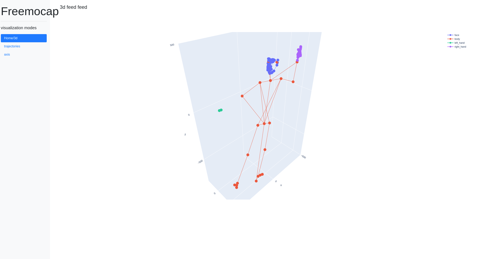
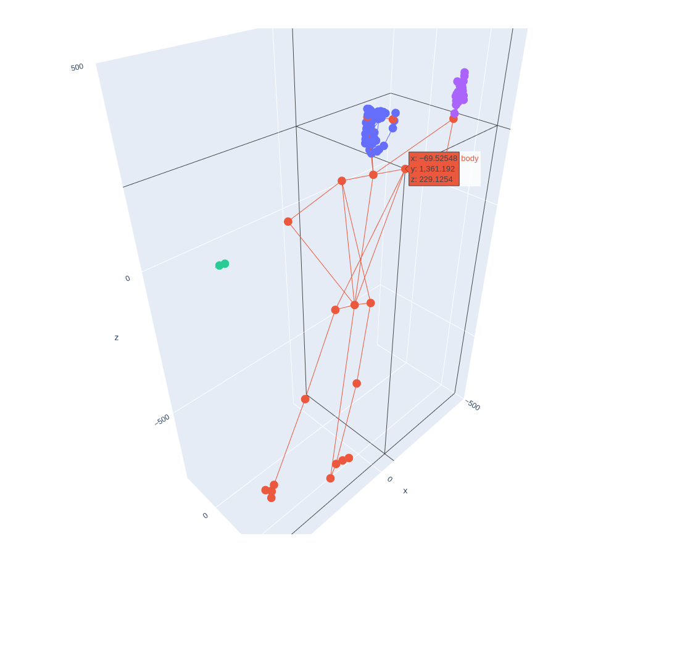

# Dash visualizer for c3d and freemocap

## 3d visualization for the mocap data in bowser


# Usage
- Python 3.8+
- Install requirements
```
pip install -r requirements.txt
```
- Download the freemocap data from [here](https://figshare.com/articles/dataset/sesh_21-07-20_165209_noOpenPose_zip/15043605) and unzip in the folder `freemocap`  
You can change file path variable here.
- Run the freemocap_visualization.py to start the flask server.
```
python freemocap_visualization.py
```
- open the 127.0.0.1/8888 port in the browser 
- To change the width and height for your browser change the this line of code.


# TODO
 - [ ] Toolbar setup
 - [ ] visualization work based on the timer
 - [ ] documentation for the fuction
 - [ ] have a button to stop the vis.
 - [ ] fix the viewing angle.
 - [ ] Add trajectory information.

### Hover infomation
